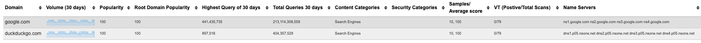

**This is a multi-domain lookup tool that uses the publicly available [Umbrella Investigate API](https://docs.umbrella.com/investigate-api/docs)**

0: Run pip3 install -r requirements.txt
1: Store your Umbrella Investigate API Token in a text file, with the API key on one line and no other information, then update the path to it.
2: Do the same for the VirusTotal API key, if you want to use it. If not or you don't have one, this will still work - you just won't have VirusTotal results.
3: Run with: python3 app.py
4: Go to http://127.0.0.1:5000
5: Enter your domains and look them up

